# 🏗️ Diagrama de Classes UML

## Arquitetura Backend - Finance Control

```mermaid
classDiagram
    %% Controllers Layer
    class AuthController {
        -UserService userService
        +register(req, res) Promise~void~
        +login(req, res) Promise~void~
        +getProfile(req, res) Promise~void~
        +updateProfile(req, res) Promise~void~
        +forgotPassword(req, res) Promise~void~
        +resetPassword(req, res) Promise~void~
    }
    
    class AccountController {
        -AccountService accountService
        +getAccounts(req, res) Promise~void~
        +getAccount(req, res) Promise~void~
        +createAccount(req, res) Promise~void~
        +updateAccount(req, res) Promise~void~
        +deleteAccount(req, res) Promise~void~
        +getBalance(req, res) Promise~void~
    }
    
    class TransactionController {
        -TransactionService transactionService
        +getTransactions(req, res) Promise~void~
        +getTransaction(req, res) Promise~void~
        +createTransaction(req, res) Promise~void~
        +updateTransaction(req, res) Promise~void~
        +deleteTransaction(req, res) Promise~void~
        +getStats(req, res) Promise~void~
        +getTrend(req, res) Promise~void~
        +getByCategory(req, res) Promise~void~
    }
    
    class CategoryController {
        -CategoryService categoryService
        +getCategories(req, res) Promise~void~
        +getCategory(req, res) Promise~void~
        +createCategory(req, res) Promise~void~
        +updateCategory(req, res) Promise~void~
        +deleteCategory(req, res) Promise~void~
        +getGlobalCategories(req, res) Promise~void~
    }
    
    class CreditCardController {
        -CreditCardService creditCardService
        +getCreditCards(req, res) Promise~void~
        +createCreditCard(req, res) Promise~void~
        +updateCreditCard(req, res) Promise~void~
        +getBills(req, res) Promise~void~
        +closeBill(req, res) Promise~void~
        +payBill(req, res) Promise~void~
    }
    
    class BudgetController {
        -BudgetService budgetService
        +getBudgets(req, res) Promise~void~
        +createBudget(req, res) Promise~void~
        +updateBudget(req, res) Promise~void~
        +getProgress(req, res) Promise~void~
    }
    
    %% Services Layer
    class UserService {
        -PrismaClient prisma
        +createUser(data) Promise~Object~
        +loginUser(credentials) Promise~Object~
        +getUserById(id) Promise~User~
        +updateUser(id, data) Promise~User~
        +requestPasswordReset(email) Promise~void~
        +resetPassword(token, newPassword) Promise~void~
        -hashPassword(password) Promise~string~
        -comparePassword(plain, hash) Promise~boolean~
        -generateToken(userId, email) string
    }
    
    class AccountService {
        -PrismaClient prisma
        +getAccountsByUser(userId) Promise~Account[]~
        +getAccountById(id, userId) Promise~Account~
        +createAccount(userId, data) Promise~Account~
        +updateAccount(id, userId, data) Promise~Account~
        +deleteAccount(id, userId) Promise~void~
        +calculateBalance(accountId) Promise~Decimal~
    }
    
    class TransactionService {
        -PrismaClient prisma
        +getTransactions(userId, filters) Promise~Transaction[]~
        +getTransactionById(id, userId) Promise~Transaction~
        +createTransaction(userId, data) Promise~Transaction~
        +updateTransaction(id, userId, data) Promise~Transaction~
        +deleteTransaction(id, userId) Promise~void~
        +getStatistics(userId, period) Promise~Object~
        +getTrend(userId, period) Promise~Object[]~
        +getByCategory(userId, filters) Promise~Object[]~
        -updateAccountBalance(accountId, amount, type) Promise~void~
    }
    
    class CategoryService {
        -PrismaClient prisma
        +getCategories(userId) Promise~Category[]~
        +getGlobalCategories() Promise~Category[]~
        +getCategoryById(id, userId) Promise~Category~
        +createCategory(userId, data) Promise~Category~
        +updateCategory(id, userId, data) Promise~Category~
        +deleteCategory(id, userId) Promise~void~
    }
    
    class CreditCardService {
        -PrismaClient prisma
        +getCreditCards(userId) Promise~CreditCard[]~
        +createCreditCard(userId, data) Promise~CreditCard~
        +updateCreditCard(id, userId, data) Promise~CreditCard~
        +getBills(cardId, userId) Promise~Bill[]~
        +closeBill(billId, userId) Promise~Bill~
        +payBill(billId, userId, amount) Promise~Bill~
        -updateAvailableLimit(cardId) Promise~void~
    }
    
    class BudgetService {
        -PrismaClient prisma
        +getBudgets(userId) Promise~Budget[]~
        +createBudget(userId, data) Promise~Budget~
        +updateBudget(id, userId, data) Promise~Budget~
        +getProgress(budgetId, userId) Promise~Object~
        -calculateSpent(budgetId, period) Promise~Decimal~
    }
    
    %% Middleware Layer
    class AuthMiddleware {
        +authenticateToken(req, res, next) void
        -verifyJWT(token) JwtPayload
    }
    
    class ValidationMiddleware {
        +validateSchema(schema) Function
        +createUserSchema Joi
        +loginSchema Joi
        +accountSchema Joi
        +transactionSchema Joi
        +categorySchema Joi
    }
    
    class ErrorMiddleware {
        +handleError(error, req, res, next) void
        +notFound(req, res) void
    }
    
    %% Models/Types
    class User {
        +string id
        +string email
        +string password
        +string name
        +DateTime createdAt
        +DateTime updatedAt
        +Account[] accounts
        +Category[] categories
        +Transaction[] transactions
    }
    
    class Account {
        +string id
        +string userId
        +string name
        +AccountType type
        +Decimal balance
        +string currency
        +boolean isActive
        +Transaction[] transactions
    }
    
    class Transaction {
        +string id
        +string userId
        +string accountId
        +string categoryId
        +TransactionType type
        +Decimal amount
        +string description
        +Date date
        +RecurringType recurringType
    }
    
    class Category {
        +string id
        +string userId
        +string name
        +CategoryType type
        +string color
        +string icon
        +boolean isGlobal
        +boolean isActive
    }
    
    class CreditCard {
        +string id
        +string userId
        +string name
        +Decimal creditLimit
        +Decimal availableLimit
        +int closingDay
        +int dueDay
        +boolean isActive
    }
    
    class Budget {
        +string id
        +string userId
        +string categoryId
        +string name
        +Decimal amount
        +string period
        +Date startDate
        +boolean isActive
    }
    
    %% Utils
    class Logger {
        +info(message, meta) void
        +error(message, error, meta) void
        +warn(message, meta) void
        +debug(message, meta) void
    }
    
    class AuditLogger {
        +logAuth(action, details) void
        +logTransaction(action, details) void
        +logError(error, context) void
    }
    
    class Config {
        +string port
        +string nodeEnv
        +string jwtSecret
        +string databaseUrl
        +Object security
    }
    
    %% Relationships - Controllers -> Services
    AuthController --> UserService
    AccountController --> AccountService
    TransactionController --> TransactionService
    CategoryController --> CategoryService
    CreditCardController --> CreditCardService
    BudgetController --> BudgetService
    
    %% Relationships - Services -> Models
    UserService --> User
    AccountService --> Account
    TransactionService --> Transaction
    CategoryService --> Category
    CreditCardService --> CreditCard
    BudgetService --> Budget
    
    %% Relationships - Services -> Utils
    UserService --> Logger
    UserService --> AuditLogger
    AccountService --> Logger
    TransactionService --> Logger
    TransactionService --> AuditLogger
    
    %% Relationships - Middleware
    AuthMiddleware --> Config
    AuthMiddleware --> Logger
    ValidationMiddleware --> Logger
    ErrorMiddleware --> Logger
    
    %% Model Relationships
    User "1" --> "N" Account
    User "1" --> "N" Category
    User "1" --> "N" Transaction
    User "1" --> "N" CreditCard
    User "1" --> "N" Budget
    
    Account "1" --> "N" Transaction
    Category "1" --> "N" Transaction
    Category "1" --> "N" Budget
```



## 📋 Camadas da Arquitetura

### 🎮 Controllers Layer
Responsável por:
- Receber requisições HTTP
- Validar entrada básica
- Chamar services apropriados
- Formatar resposta JSON padronizada
- Tratamento de erros HTTP

**Padrão de Response:**
```typescript
{
  success: boolean,
  data?: any,
  message: string
}
```

### 🔧 Services Layer
Responsável por:
- Lógica de negócio
- Interação com banco de dados (Prisma)
- Validações complexas
- Cálculos e agregações
- Chamadas a serviços externos

**Princípios:**
- Cada service é independente
- Não conhece detalhes HTTP
- Retorna dados puros (não Response)
- Lança exceções para erros

### 🛡️ Middleware Layer
Responsável por:
- Autenticação (JWT validation)
- Validação de schemas (Joi)
- Logging de requisições
- Rate limiting
- Tratamento de erros global
- CORS e segurança (Helmet)

### 📦 Models/Types
Responsável por:
- Definição de tipos TypeScript
- Interfaces de dados
- Enums
- DTOs (Data Transfer Objects)

### 🛠️ Utils
Responsável por:
- Funções auxiliares
- Loggers (Winston)
- Configurações
- Helpers genéricos

## 🔄 Fluxo de Requisição

```
HTTP Request
    ↓
Middleware (Auth, Validation)
    ↓
Controller (recebe req/res)
    ↓
Service (lógica de negócio)
    ↓
Prisma (database query)
    ↓
Database (PostgreSQL)
    ↓
Prisma (retorna dados)
    ↓
Service (processa dados)
    ↓
Controller (formata response)
    ↓
Middleware (log, error handling)
    ↓
HTTP Response
```

## 🎯 Padrões de Design

### 1. Dependency Injection
Services são injetados nos controllers:
```typescript
class AuthController {
  private userService = new UserService();
}
```

### 2. Repository Pattern
Prisma Client age como repository:
```typescript
await prisma.user.findUnique({ where: { id } });
```

### 3. Service Layer Pattern
Lógica de negócio isolada dos controllers:
```typescript
class UserService {
  async createUser(data) {
    // validação, hash de senha, criação
  }
}
```

### 4. Middleware Pattern
Funções interceptam requisições:
```typescript
router.use(authenticateToken);
router.get('/profile', controller.getProfile);
```

### 5. DTO Pattern
Objetos transferem dados entre camadas:
```typescript
interface CreateUserDTO {
  name: string;
  email: string;
  password: string;
}
```

## 🔐 Segurança

### Autenticação
- JWT com middleware `authenticateToken`
- Token anexado ao request: `req.user`
- Validação em todas as rotas protegidas

### Validação
- Schemas Joi para inputs
- Sanitização de dados
- Type checking com TypeScript

### Auditoria
- Logs de todas as ações importantes
- Registro de IPs e User-Agents
- Tracking de mudanças

## 🧪 Testabilidade

A arquitetura em camadas facilita testes:

**Unit Tests:**
- Services isolados
- Mocks do Prisma
- Funções puras

**Integration Tests:**
- Controllers + Services
- Database em memória
- Requisições HTTP

**E2E Tests:**
- Fluxos completos
- Database real
- API endpoints

## 📊 Métricas e Performance

### Logging
- Winston para logs estruturados
- Níveis: error, warn, info, debug
- Metadata contextual

### Monitoring
- Logs de performance
- Tracking de queries lentas
- Auditoria de acessos

### Otimização
- Índices no banco
- Eager/Lazy loading com Prisma
- Caching (futuro: Redis)
