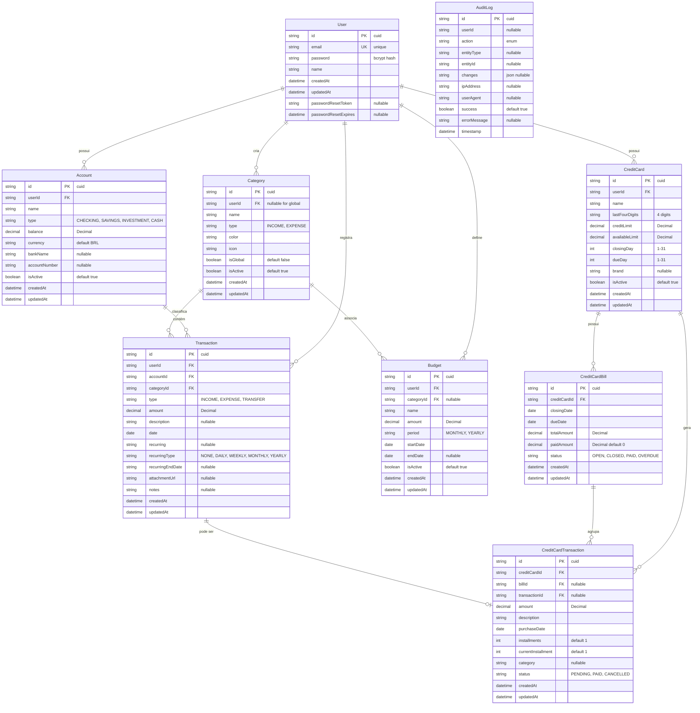

# 🗄️ Diagrama Entidade-Relacionamento (ERD)

## Banco de Dados - Finance Control

## 📝 Descrição das Entidades

### 👤 User
Usuários do sistema com autenticação JWT.

**Relacionamentos:**
- 1 usuário → N contas (accounts)
- 1 usuário → N categorias personalizadas (categories)
- 1 usuário → N transações (transactions)
- 1 usuário → N cartões de crédito (credit cards)
- 1 usuário → N orçamentos (budgets)

### 💰 Account
Contas bancárias/financeiras do usuário.

**Tipos:** Conta Corrente, Poupança, Investimento, Dinheiro

**Relacionamentos:**
- N contas → 1 usuário
- 1 conta → N transações

### 🏷️ Category
Categorias para classificação de transações.

**Sistema Híbrido:**
- 47 categorias globais (`isGlobal=true`, `userId=null`)
- Categorias personalizadas por usuário (`isGlobal=false`, `userId=<id>`)

**Tipos:** Receita (INCOME), Despesa (EXPENSE)

**Relacionamentos:**
- N categorias → 1 usuário (ou null para globais)
- 1 categoria → N transações
- 1 categoria → N orçamentos

### 💸 Transaction
Transações financeiras (receitas, despesas, transferências).

**Tipos:** INCOME, EXPENSE, TRANSFER

**Recursos:**
- Transações recorrentes
- Anexos
- Notas
- Vinculação com cartão de crédito

**Relacionamentos:**
- N transações → 1 usuário
- N transações → 1 conta
- N transações → 1 categoria
- 1 transação → 1 transação de cartão (opcional)

### 💳 CreditCard
Cartões de crédito do usuário.

**Recursos:**
- Limite de crédito
- Dias de fechamento e vencimento
- Controle de limite disponível

**Relacionamentos:**
- N cartões → 1 usuário
- 1 cartão → N transações de cartão
- 1 cartão → N faturas

### 🧾 CreditCardTransaction
Compras realizadas no cartão de crédito.

**Recursos:**
- Parcelamento
- Status (pendente, pago, cancelado)
- Vinculação com transação bancária

**Relacionamentos:**
- N transações de cartão → 1 cartão
- N transações de cartão → 1 fatura (quando fechada)
- 1 transação de cartão → 1 transação (opcional)

### 📄 CreditCardBill
Faturas mensais do cartão de crédito.

**Status:** OPEN, CLOSED, PAID, OVERDUE

**Relacionamentos:**
- N faturas → 1 cartão
- 1 fatura → N transações de cartão

### 🎯 Budget
Orçamentos por categoria ou geral.

**Períodos:** Mensal, Anual

**Relacionamentos:**
- N orçamentos → 1 usuário
- N orçamentos → 1 categoria (opcional)

### 📋 AuditLog
Logs de auditoria de todas as ações importantes.

**Eventos Auditados:**
- Autenticação (login, logout, falhas)
- CRUD de entidades
- Alterações críticas
- Tentativas de acesso não autorizado

## 🔑 Regras de Integridade

### Constraints
- Email único por usuário
- Categorias globais sem userId
- Transações sempre vinculadas a usuário, conta e categoria
- Cartões com dias válidos (1-31)
- Faturas com status consistente
- Limites de cartão >= limite disponível

### Índices
- `User.email` (unique)
- `Transaction.userId, date` (composite)
- `Category.userId, isGlobal` (composite)
- `CreditCardBill.creditCardId, status` (composite)
- `AuditLog.userId, timestamp` (composite)

### Soft Delete
Entidades principais usam flag `isActive` ao invés de deleção física:
- Account
- Category (user-created)
- CreditCard
- Budget

## 📊 Cardinalidade

| Relacionamento | Tipo | Descrição |
|----------------|------|-----------|
| User → Account | 1:N | Um usuário possui várias contas |
| User → Category | 1:N | Um usuário cria várias categorias |
| User → Transaction | 1:N | Um usuário registra várias transações |
| User → CreditCard | 1:N | Um usuário possui vários cartões |
| User → Budget | 1:N | Um usuário define vários orçamentos |
| Account → Transaction | 1:N | Uma conta contém várias transações |
| Category → Transaction | 1:N | Uma categoria classifica várias transações |
| Category → Budget | 1:N | Uma categoria associa-se a vários orçamentos |
| CreditCard → CreditCardTransaction | 1:N | Um cartão gera várias transações |
| CreditCard → CreditCardBill | 1:N | Um cartão possui várias faturas |
| CreditCardBill → CreditCardTransaction | 1:N | Uma fatura agrupa várias transações |
| Transaction → CreditCardTransaction | 1:1 | Relação opcional (apenas para compras no cartão) |

## 🗂️ Segregação de Dados

Todos os dados são segregados por usuário (`userId` como FK), garantindo:
- ✅ Isolamento completo entre usuários
- ✅ Queries eficientes com filtro por userId
- ✅ Segurança: um usuário não acessa dados de outro
- ✅ LGPD compliance: fácil exclusão de todos os dados de um usuário

## 🔐 Segurança

- Senhas: Hash bcrypt (10+ rounds)
- Tokens: JWT com expiração de 7 dias
- Audit Trail: Todas as ações importantes logadas
- Soft Delete: Preserva histórico para auditoria
- Constraints: Garantem integridade referencial
