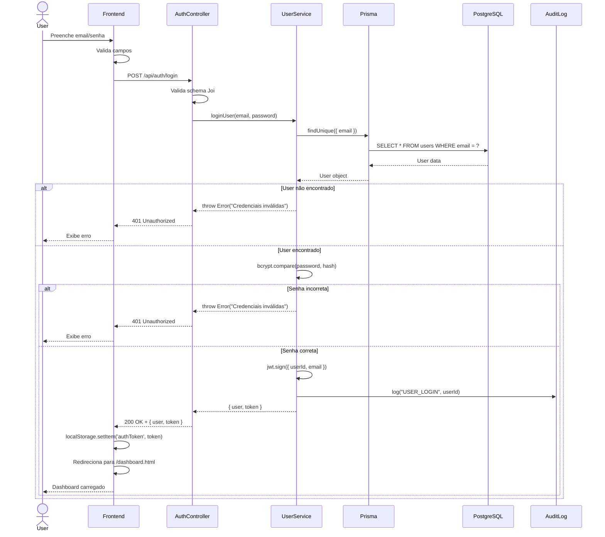
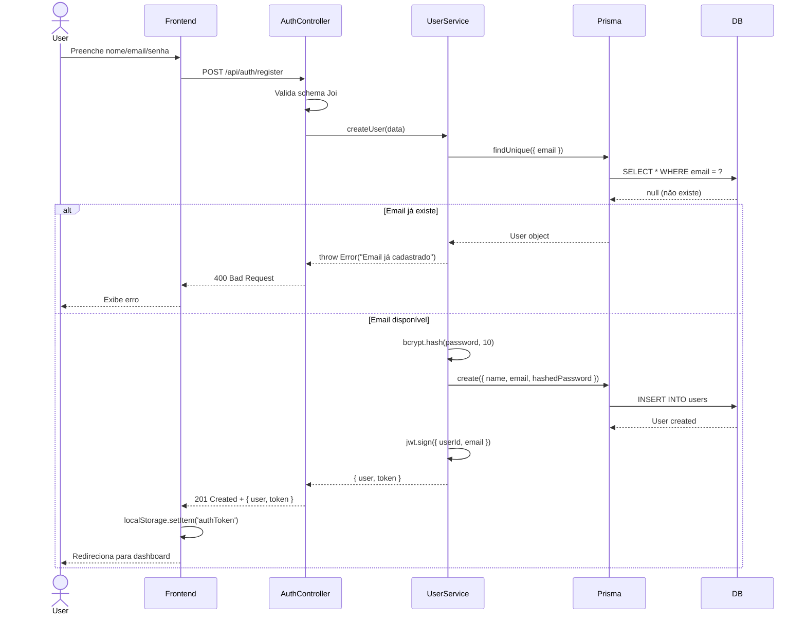
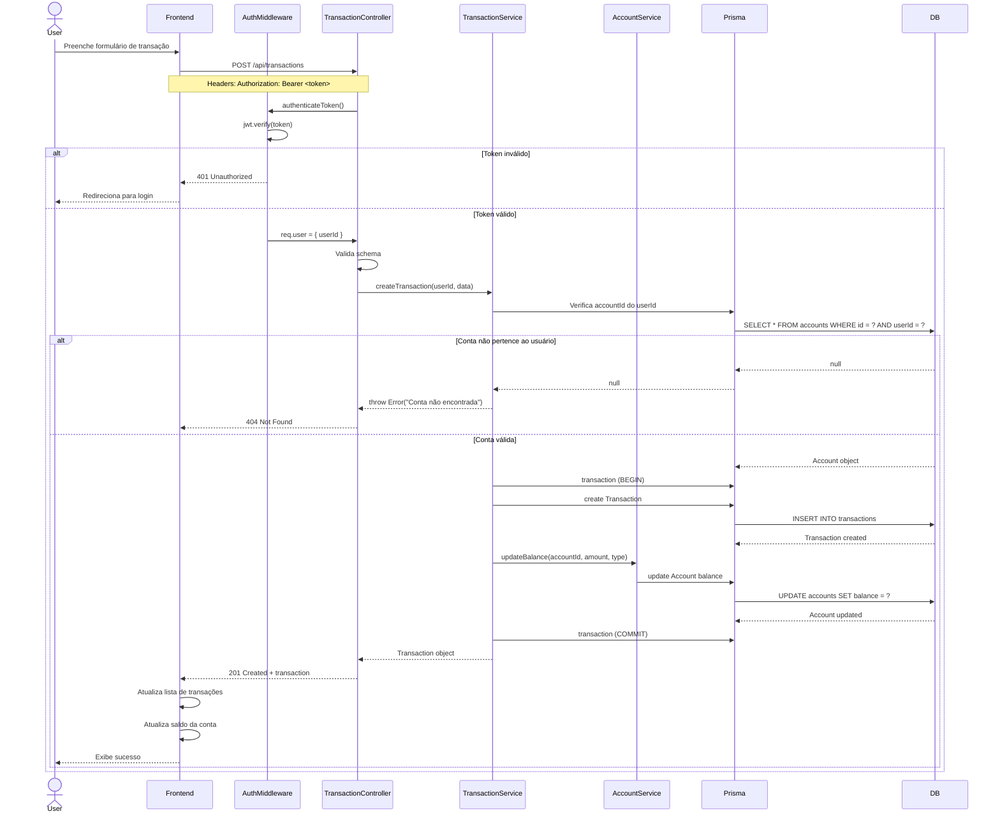
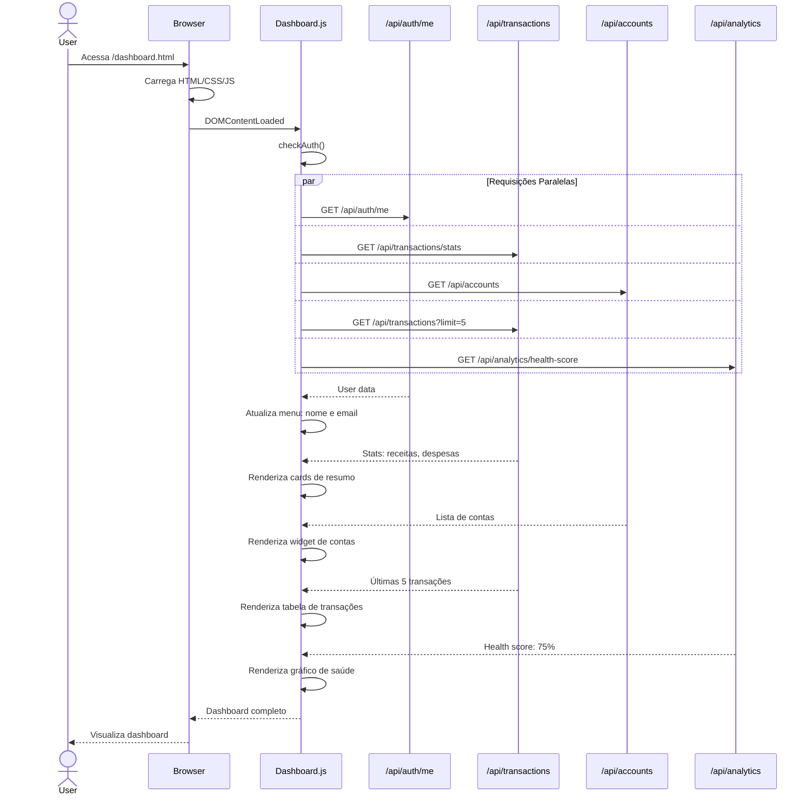
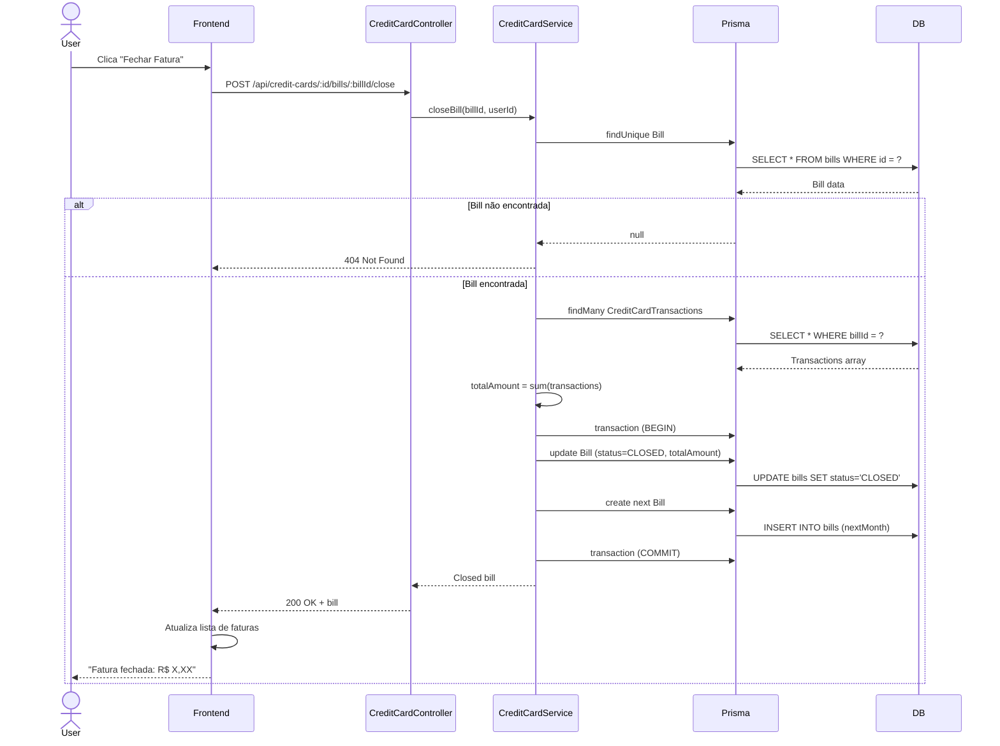
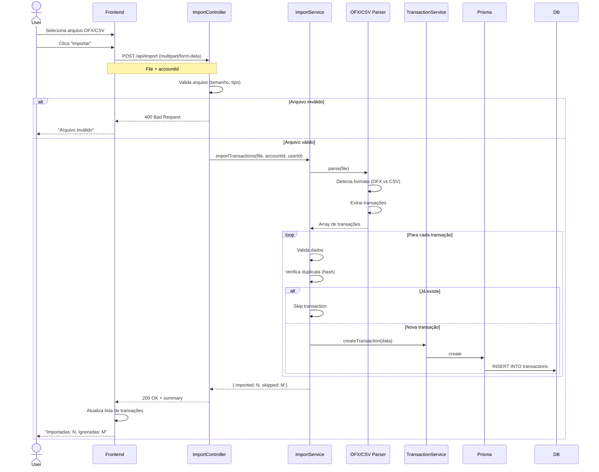

# 🔄 Diagramas de Sequência

## Principais Fluxos do Finance Control

### 1. 🔐 Fluxo de Autenticação - Login

### 2. 📝 Fluxo de Registro

### 3. 💸 Fluxo de Criação de Transação

### 4. 📊 Fluxo de Dashboard - Carregamento de Dados

### 5. 💳 Fluxo de Fechamento de Fatura de Cartão

### 6. 🔄 Fluxo de Importação de Extrato (OFX/CSV)

## 🔍 Notas sobre os Diagramas

### Padrões Comuns

1. **Autenticação**: Todas as rotas protegidas passam pelo `AuthMiddleware`
2. **Validação**: Controllers validam schemas antes de chamar services
3. **Transações DB**: Operações críticas usam Prisma transactions
4. **Audit Log**: Ações importantes são auditadas
5. **Error Handling**: Erros são capturados e retornados com status HTTP apropriado

### Otimizações

- **Requisições Paralelas**: Dashboard faz múltiplas chamadas em paralelo
- **Lazy Loading**: Dados são carregados sob demanda
- **Caching**: Token JWT evita consultas repetidas ao DB
- **Bulk Operations**: Importações processam lotes de transações

### Segurança

- **Token Validation**: Toda requisição autenticada valida JWT
- **User Isolation**: Queries sempre filtram por `userId`
- **Input Validation**: Joi valida todos os inputs
- **SQL Injection**: Prisma previne com prepared statements
